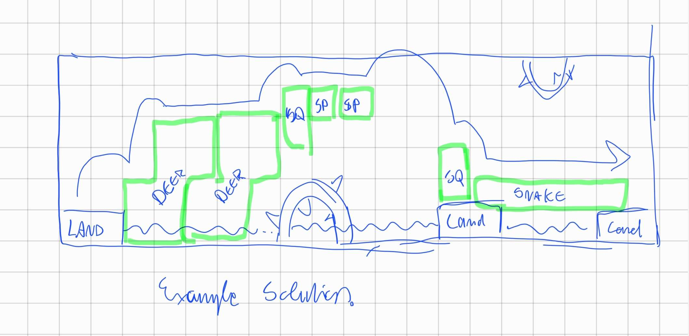

# Animals / Building Blocks
- each animal has one property
- you can place blocks adjacant to both shores, obstacles and all animals
- you can only place animals on top of each other (barring special property)
- animals can be rotated by 90 degrees

## Spider
- size: smallest (1x1)
- property: can be attached to anything from all sides, all animals can attach to it

## Snake
- size: long (1x5)
- property: cannot place any blocks adjacent to head

## Deer
- size: big (4x3)
- property: legs can be in water

## Squirrel
- size: medium (2x1)
- property: can be attached sideways

# Bridge Traversal
- fox needs to get to other shore without touching water
- fox can jump 

# Obstacles
- Thorns: Animals cannot be placed on Thorns, Fox cannot touch Thorns

# Example Level
- Animals: 2 copies of each type, except snakes (only 1 copy)
